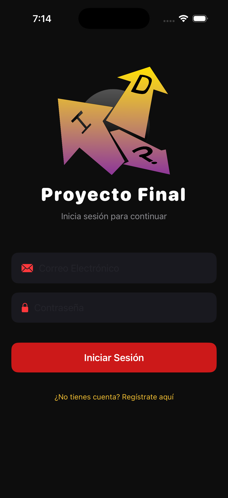
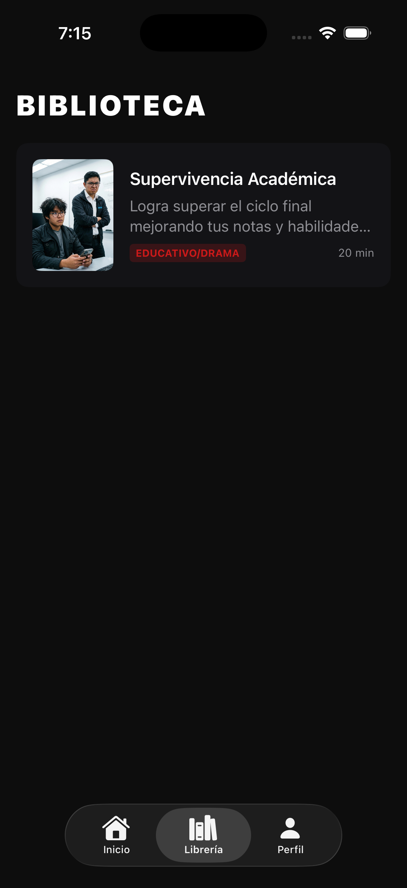
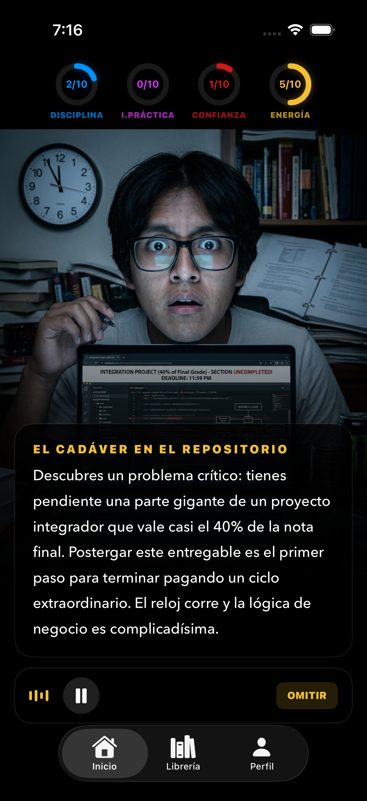
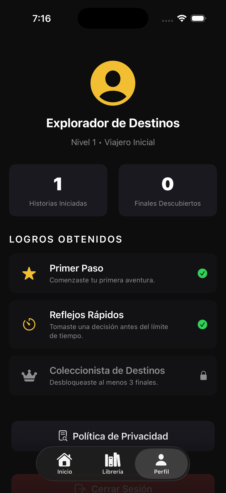

# Proyecto Final - AXL (Explorador de Destinos)

¡Bienvenido al repositorio de **AXL**! Esta aplicación es una experiencia interactiva tipo novela visual o "Elige tu propia aventura", donde tus decisiones influyen en la historia, permitiéndote desbloquear diversos finales, escuchar narraciones inmersivas y llevar un registro completo de tus progresos.

---

## 📖 Descripción del Proyecto

Proyecto Final es una aplicación móvil para iOS orientada a brindar experiencias narrativas únicas. A través de una interfaz moderna y llamativa inspirada en el modo oscuro (Dark Mode), los usuarios pueden:
- Leer o escuchar diferentes historias interactivas.
- Tomar decisiones críticas que alteran la trama y llevan a distintos finales.
- Obtener logros según su estilo de juego (rapidez, cantidad de finales desbloqueados, etc.).
- Gestionar su cuenta y datos personales, manteniendo siempre el control (incluyendo la eliminación definitiva de los mismos).

---

## 🛠️ Stack Tecnológico (Tech Stack)

La aplicación ha sido desarrollada utilizando tecnologías y herramientas modernas para garantizar escalabilidad, seguridad y un rendimiento nativo:

- **Lenguaje:** Swift
- **UI Framework:** SwiftUI
- **Base de Datos Local:** SwiftData (Para persistencia offline de progresos)
- **Autenticación:** Firebase Authentication (Manejo de usuarios, sesiones y eliminación de cuenta)
- **Base de Datos Remota:** Firebase Firestore (Almacenamiento y sincronización de progreso en la nube)
- **Audio y Voz:** `AVFoundation` para música de fondo y `AVSpeechSynthesizer` para narración de historias (Text-to-Speech de alta calidad).
- **Consumo de API:** Llamadas HTTP con `URLSession` para descargar contenido dinámico de historias.

---

## 📸 Capturas de Pantalla

### 1. Pantalla de Inicio / Autenticación

> Pantalla de inicio de sesión y registro de usuarios con retroalimentación visual.

### 2. Librería de Historias

> Catálogo donde el usuario puede explorar las diferentes historias disponibles, conocer la duración y el género.

### 3. Escena Interactiva / Narrativa

> La vista principal del juego, mostrando la imagen de fondo, el texto narrativo y los botones con límite de tiempo para tomar decisiones.

### 4. Perfil del Usuario y Logros

> Panel de usuario que muestra estadísticas (historias iniciadas, finales), logros desbloqueados y gestión de cuenta (cerrar sesión / eliminar cuenta).

---

## 🚀 Instalación y Uso Local

Si deseas clonar y probar este proyecto localmente:

1. Clona el repositorio:
   ```bash
   git clone https://github.com/tu_usuario/ProyectoFinal.git
   ```
2. Abre el proyecto en Xcode:
   ```bash
   cd ProyectoFinal
   open ProyectoFinal.xcodeproj
   ```
3. **¡Importante!** Agrega el archivo `GoogleService-Info.plist` (ignorado en este repositorio por seguridad) dentro de la carpeta `ProyectoFinal/` para habilitar los servicios de Firebase.
4. Selecciona un simulador o dispositivo físico (iOS 16+) y presiona **Run (Cmd + R)**.

---

## 🔐 Privacidad y Seguridad

Este proyecto respeta las normativas de privacidad y recopilación de datos de Apple (Guideline 5.1.1). Los usuarios cuentan con una función transparente para eliminar su cuenta de manera permanente, eliminando todos sus datos almacenados tanto en el cliente como en Firestore.

---

*Desarrollado con ❤️ para Proyecto Final.*
